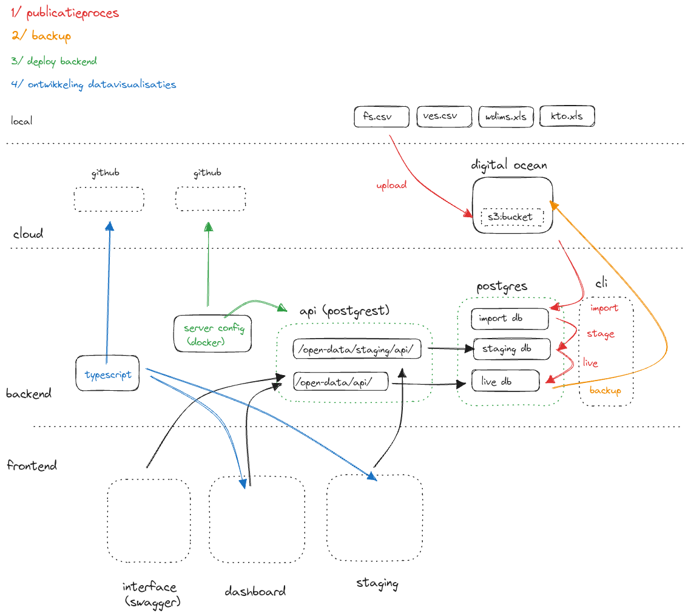

### deploy

```
 cd docker
 cp .env.example .env
 nano .env
 docker-compose up -d

```
### nginx
 nginx server that provides access through:

|path|omschrijving|
|---|---|
| /open-data/api | rest api live data |
| /open-data/staging/api | rest api staging data |
| /open-data/dev/api | rest api dev data |
| /graphs/ | live dashboard |
| /frontend/staging/ | staging dashboard |  
| /frontend/dev/ | dev dashboard |
  /frontend/new/ | dev dashboard |
| /publieke-data/docs/ | swagger interface |
| /pgadmin4/ | pgadmin interface |

### Overige containers:

|naam|omschrijving|
|---|---|
| db1 | postgres databases | 
| pgadmin1 | webinterface for postgres |
| server1 | rest api with complete live data |
| staging-server1 | rest api with complete staging data | 
| dev-server1 | rest api with complete dev data |
| public-server1 | rest api with smaller relevent selection of live data |
| swagger1 | webinterface to query live data |
| node | node js application for maintenance tasks, like import scripts |

### CLI 

/usr/bin/img -> command line interface to call methods on node application 

```
Commands:

  img db:backup [db]        backup database to the spaces bucket in digital ocean
  img db:prepare [db]       prepare database for data entry
  img data:entry [week]     import data from csv
  img db:stage [db]         connect staging dashboard to this database
  img db:publish [db]       promote staging database to public
  img db:dev [db]           connect dev dashboard to this database

  img api:view [name] [db]  add the public read permissions for a new api endpoint
  
```

### publication process 

files must be uploaded to folder on cloud 

For week 1 of the year 2024
 ```
img db:backup // create a backup of the current live/public db 
img db:prepare img_2401 // create a new db from the backup 
img data:entry 1 --topic fs --db img_2401  // import data from fs.csv
img data:entry 1 --topic ves --db img_2401  // import data from ves.csv
img data:entry 1 --topic wdims --db img_2401  // import data from wdims.xlsx
img data:entry 1 --topic kto --db img_2401  // import data from kto.xlsx
docker logs node // check results
img db:stage img_2401 -- connect staging dashboard to this database
https://img.publikaan.nl/frontend/staging/dashboard.html -- check graphs for strange/incorrect data entries 
img db:publish 
```

